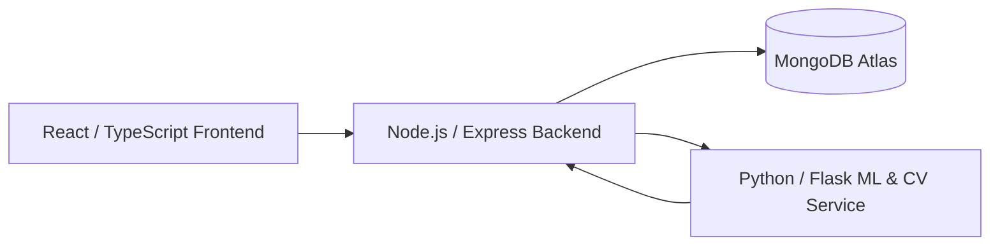
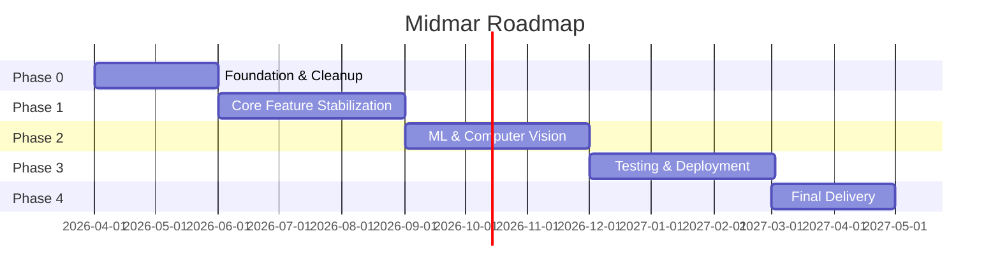

# Midmar [ Project Roadmap & Development Charter ]

**A football analytics platform combining full-stack engineering and applied machine learning**

| | |
|---|---|
| **Project name** | Midmar *(repository: FOOTBRAIN)* |
| **Team** | Hala Al Hendi , Asala Abu Ghrara , Sarah Abumandil , Mohamed Awad |
| **Timeline** | April 2026 – April 2027 (13 months) |
| **Document version** | 1.0 |
| **Document type** | Project Roadmap & Development Charter |

---

## Table of Contents

1. [Executive Summary](#1-executive-summary)
2. [Problem Statement & Motivation](#2-problem-statement--motivation)
3. [Vision & Objectives](#3-vision--objectives)
4. [Scope](#4-scope)
5. [System Overview](#5-system-overview)
6. [Team Structure & Responsibilities](#6-team-structure--responsibilities)
7. [Methodology](#7-methodology)
8. [Roadmap Phases](#8-roadmap-phases)
9. [Milestone Timeline](#9-milestone-timeline)
10. [Risk Register](#10-risk-register)
11. [Success Metrics](#11-success-metrics)
12. [Resources & Tools](#12-resources--tools)
13. [Appendix](#13-appendix)

---

## 1. Executive Summary

Midmar is a full-stack football (soccer) analytics platform that combines a React/TypeScript frontend, a Node.js/Express backend, and a Python-based machine learning service to give clubs and analysts data-driven insight into player value, injury risk, and match-video performance. This document defines a 13-month roadmap, from **April 2026 to April 2027**, structured into five sequential phases, each with explicit objectives, tasks, ownership, and exit criteria, so the team can execute the project with the same rigor expected of a senior capstone or applied-research project.

This roadmap exists to answer four questions at every point in the project's life: **what are we building, who owns it, by when, and how do we know it is done.**

---

## 2. Problem Statement & Motivation

Football clubs, scouts, and analysts generate enormous volumes of player and match data, but small and mid-sized clubs — and student teams studying the problem — typically lack access to the proprietary analytics tools (Opta, StatsBomb, Wyscout) that top-tier clubs use. This creates a gap: performance evaluation, transfer-value estimation, and injury-risk assessment remain largely manual, intuition-driven processes for everyone else.

**Midmar addresses this gap** by providing an open, extensible platform that applies supervised machine learning to publicly-structured football data (goals, assists, physical attributes, match events) and computer vision to raw match footage, surfacing the same categories of insight — market value, injury risk, physical output — through an accessible web interface.

---

## 3. Vision & Objectives

**Vision statement:** *Make football analytics that used to require a data science team accessible through a browser tab.*

### Primary objectives (SMART)

| # | Objective | Measure of success |
|---|---|---|
| O1 | Ship a stable, deployed, publicly accessible web application | Live URL, >99% uptime over final month |
| O2 | Achieve reliable market-value and injury-risk predictions | Model validated against held-out test data with documented error margins (e.g. MAE, RMSE) |
| O3 | Deliver working video-based player tracking | End-to-end pipeline: upload → analysis → annotated output, tested on ≥10 real match clips |
| O4 | Produce a secure, maintainable codebase | Zero committed secrets, passing CI (lint + test) on every merge, documented API |
| O5 | Document the system to an academic/professional standard | Complete README, architecture diagrams, this roadmap, and a final report/thesis document |

---

## 4. Scope

### In scope
- Player CRUD, performance tracking, and dashboard analytics
- Market value prediction (general, defender, and goalkeeper-specific models)
- Injury risk prediction from physical attributes
- Match-video upload and player-tracking/distance analysis
- Role-based access (standard user / analyst / admin)
- Admin panel: user management, activity audit log, reporting
- Deployment to a publicly accessible environment

### Out of scope (for this roadmap cycle — candidates for future work)
- Real-time / live match tracking
- Multi-camera stitching for full-pitch coverage
- Native mobile application
- Tactical comparison / opposition-scouting views
- Payment or subscription infrastructure

---

## 5. System Overview

Midmar is composed of three cooperating services:

| Layer | Responsibility |
|---|---|
| Frontend | User interface, auth state, data visualization |
| Backend | Authentication, business logic, data persistence, request routing to the ML service |
| ML/CV service | Market-value and injury-risk inference (XGBoost), video analysis (OpenCV + YOLO/PyTorch) |
| Database | Persistent storage for users, players, matches, predictions, and audit logs |

*(Full technical detail — tech stack, API reference, data models — lives in `README.md`; this roadmap focuses on the plan to build and ship it.)*

---

## 6. Team Structure & Responsibilities

Four team members, each anchored to a primary domain but expected to contribute across layers where needed — this is a small team, and silos are a risk in themselves (see [§10 Risk Register](#10-risk-register)).

| Team member | Primary role | Primary ownership | Secondary ownership |
|---|---|---|---|
| **Sarah Abumandil** | Project Lead / Backend Engineer | Node/Express API, authentication, database schema, deployment coordination | Project management, sprint planning |
| **Hala Al Hendi** | Frontend Engineer | React UI, dashboard, admin panel, UX | API integration, accessibility |
| **Asala Abu Ghrara** | ML/AI Engineer | Market value & injury-risk models, data preprocessing, model evaluation | Video analysis pipeline support |
| **Mohamed Awad** | QA / DevOps Engineer | Testing (unit, integration, end-to-end), CI/CD, environment & deployment configuration | Security review, documentation |

> **Note:** Role assignments above are a proposed starting structure based on common capstone team patterns — swap them to match your team's actual strengths. What matters more than *who* owns each box is that **every box has exactly one owner**, so nothing falls through the cracks.

### RACI summary (who is Responsible, Accountable, Consulted, Informed)

| Activity | Sarah | Hala | Asala | Mohamed |
|---|---|---|---|---|
| Backend API development | R/A | C | I | C |
| Frontend development | C | R/A | I | C |
| ML model training & evaluation | I | I | R/A | C |
| Video analysis pipeline | C | I | R | A |
| Testing & QA | C | C | C | R/A |
| Deployment & infrastructure | A | I | I | R |
| Final documentation/report | A | R | R | R |

---

## 7. Methodology

The team will work in **two-week sprints**, Agile-style, for a total of ~26 sprints across the roadmap.

- **Sprint planning** — every two weeks, define the sprint backlog from the current phase's task list.
- **Daily/async standups** — short written check-ins (even a shared doc or chat channel is enough for a 4-person team) covering: what was done, what's next, what's blocked.
- **Sprint review** — demo working software at the end of each sprint, even if it's partial.
- **Sprint retrospective** — 15 minutes, every sprint: what worked, what didn't, one thing to change.
- **Version control discipline** — feature branches, pull requests reviewed by at least one other team member before merging to `main`, descriptive commit messages (not just "fix").

All source code lives in the GitHub repository; this roadmap's phases and milestones should be mirrored into the team's GitHub Project board (see [§13 Appendix](#13-appendix) for how to do that with the "Roadmap" view already created).

---

## 8. Roadmap Phases

### Phase 0 — Foundation & Technical Debt Cleanup
**April 2026 – May 2026 (Sprints 1–3)**

Before building new features, the existing codebase needs to be made safe and sound to build on. This phase exists because an audit of the current repository surfaced issues that would compound if left unaddressed.

| Task | Owner | Deliverable |
|---|---|---|
| Rotate all leaked credentials (MongoDB URI, JWT secret, admin password) | Sarah | New secrets issued, old ones invalidated |
| Remove `.env`, build output, and the committed Python virtual environment from git history | Mohamed | Clean `.gitignore`; repository size reduced |
| Merge the two duplicate Python API folders into one | Asala | Single source of truth for the ML service |
| Fix `requirements.txt` (missing `torch`, `ultralytics`) | Asala | Reproducible Python environment via one `pip install -r requirements.txt` |
| Remove hardcoded personal file paths from `app.py` | Asala | Environment-variable-driven config, portable across machines |
| Set up CI (lint + test on every PR) | Mohamed | GitHub Actions workflow passing |
| Write/finalize project documentation (`README.md`, this roadmap) | All | Published and linked in repo |

**Exit criteria:** fresh clone → `npm install` + `pip install -r requirements.txt` → app runs locally with zero manual workarounds, and no secrets exist in git history.

---

### Phase 1 — Core Feature Stabilization
**June 2026 – August 2026 (Sprints 4–9)**

Harden and complete the application's core (non-ML) functionality: authentication, player/match data management, and the dashboard.

| Task | Owner | Deliverable |
|---|---|---|
| Authentication & role-based access audit (user / analyst / admin) | Sarah | Verified route protection across all roles |
| Player CRUD + bulk import polish | Sarah, Hala | Stable player management UI + API |
| Dashboard analytics (stats, recent activity, trends) | Hala | Functional dashboard connected to live data |
| Admin panel (user management, activity logs) | Hala, Sarah | Complete admin workflows |
| Frontend code quality pass (remove `any` types, fix lint warnings) | Hala | Clean `npm run lint` output |
| Unit tests for critical components and API routes | Mohamed | Test coverage report, CI gate |

**Exit criteria:** a user can sign up, log in, manage players, and view a populated dashboard, end-to-end, without manual database edits.

---

### Phase 2 — Machine Learning & Computer Vision
**September 2026 – November 2026 (Sprints 10–15)**

This is the project's research-and-development core: validating, documenting, and improving the predictive models and the video analysis pipeline.

| Task | Owner | Deliverable |
|---|---|---|
| Data collection/cleaning for market value & injury-risk training sets | Asala | Documented, versioned dataset |
| Train/retrain market value models (general, defender, goalkeeper) | Asala | Model artifacts + evaluation report (MAE/RMSE, feature importance) |
| Train/validate injury-risk model | Asala | Model artifact + evaluation report (precision/recall, ROC-AUC) |
| Stabilize the video analysis pipeline (OpenCV + YOLO) | Asala, Mohamed | Reliable upload → tracked-output pipeline, tested on real clips |
| Model serving integration test (Node ↔ Flask) | Sarah, Asala | Verified prediction round-trip under load |
| Document model limitations & confidence bounds | Asala | Written methodology section for final report |

**Exit criteria:** all three prediction types return results within documented accuracy bounds on a held-out test set, and video analysis completes successfully on a representative sample of match clips.

---

### Phase 3 — Testing, Hardening & Deployment
**December 2026 – February 2027 (Sprints 16–21)**

Move from "works on our machines" to "works in production."

| Task | Owner | Deliverable |
|---|---|---|
| End-to-end test suite (critical user flows) | Mohamed | Automated E2E tests passing in CI |
| Security review (auth, input validation, file upload handling) | Mohamed, Sarah | Signed-off security checklist |
| Performance pass (frontend bundle size, API response times, model inference time) | Hala, Sarah, Asala | Documented before/after benchmarks |
| Production deployment: frontend (Vercel), backend + ML service (Render/Railway), database (Atlas) | Mohamed, Sarah | Live, publicly reachable application |
| Monitoring & error logging in production | Mohamed | Basic uptime/error visibility |
| User acceptance testing with real/sample users | All | UAT feedback log and resulting fixes |

**Exit criteria:** the application is live at a public URL, all core flows work for an outside user with no setup, and there is a basic process for noticing when something breaks.

---

### Phase 4 — Final Delivery & Forward Roadmap
**March 2027 – April 2027 (Sprints 22–26)**

Close the loop: polish, document, present, and define what comes next.

| Task | Owner | Deliverable |
|---|---|---|
| Final bug-fix pass from UAT feedback | All | Stable release candidate |
| Final written report / thesis documentation | All | Submitted final document |
| Presentation & demo preparation | All | Rehearsed live demo + slides |
| Project defense / final presentation | All | Delivered presentation |
| Post-mortem & lessons learned | All | Internal retrospective document |
| Forward roadmap for future contributors (real-time tracking, mobile app, multi-camera) | Sarah | Published "Future Work" section |

**Exit criteria:** project presented, defended, and documented to a standard that a new contributor (or an evaluator) can understand the system and its results without live explanation.

---

## 9. Milestone Timeline

| Milestone | Target date | Phase |
|---|---|---|
| M1 — Clean, secure, documented codebase | End of May 2026 | Phase 0 |
| M2 — Core app feature-complete & tested | End of August 2026 | Phase 1 |
| M3 — Validated ML models + working video pipeline | End of November 2026 | Phase 2 |
| M4 — Production deployment live | End of February 2027 | Phase 3 |
| M5 — Final submission & presentation | End of April 2027 | Phase 4 |

---

## 10. Risk Register

| Risk | Likelihood | Impact | Mitigation |
|---|---|---|---|
| Small team (4 people) means single points of failure per domain | Medium | High | Cross-train on secondary ownership (see §6); document as you go, not at the end |
| ML model accuracy insufficient for meaningful predictions | Medium | High | Set realistic accuracy targets early in Phase 2; report honest error margins rather than overselling results |
| Video pipeline (`torch`/`ultralytics`) too slow or resource-heavy for free-tier hosting | High | Medium | Budget for a paid tier on Render/Railway for the ML service, or scope video analysis to shorter clips |
| Scope creep beyond the 13-month timeline | Medium | Medium | Hold scope firm per §4; defer "out of scope" items explicitly rather than silently absorbing them |
| Leaked credentials / repo hygiene issues resurface | Low (post Phase 0) | High | Add a pre-commit hook or CI secret-scanner so this can't happen again |
| Dependency drift (Node/Python versions, breaking package updates) | Medium | Low | Pin versions, document exact Node/Python versions used |

---

## 11. Success Metrics

| Metric | Target |
|---|---|
| Application uptime (final month) | ≥ 99% |
| Market value prediction error (MAE) | Documented and improving sprint over sprint |
| Injury risk model AUC | ≥ 0.75 |
| Video analysis success rate on test clips | ≥ 90% complete without manual intervention |
| CI pass rate on `main` | 100% (no merges with failing tests) |
| Critical/high severity security findings at final review | 0 |
| Test coverage on core API routes | ≥ 70% |

---

## 12. Resources & Tools

| Category | Tool |
|---|---|
| Version control | GitHub |
| Project tracking | GitHub Projects (Roadmap view) |
| Frontend hosting | Vercel |
| Backend / ML service hosting | Render or Railway |
| Database | MongoDB Atlas (free tier) |
| CI/CD | GitHub Actions |
| Communication | Team's chosen chat tool (Slack/WhatsApp/Discord) for async standups |

---

## 13. Appendix

### Turning this roadmap into your GitHub Project board

Your GitHub Project ("Roadmap" view) currently has no date field, which is why it's showing the empty-state prompt. To populate it with this plan:

1. Open the project → click **+ New field** → add a **Date** field named `Start date` and another named `Target date`.
2. Create one item per **Phase** (Phase 0 through Phase 4) using the section titles from §8.
3. Set each item's `Start date` / `Target date` from the ranges in §9 (Milestone Timeline).
4. Optionally, create sub-items for each row in the Phase tables (§8) and assign them to the responsible team member via an **Assignees** field.
5. Switch the view to **Roadmap** (timeline) layout — it will now render a Gantt-style view automatically from the date fields.

### Related documents
- `README.md` — technical documentation (architecture, setup, API reference)
- This document should be reviewed and updated at the end of every phase, not written once and forgotten.
